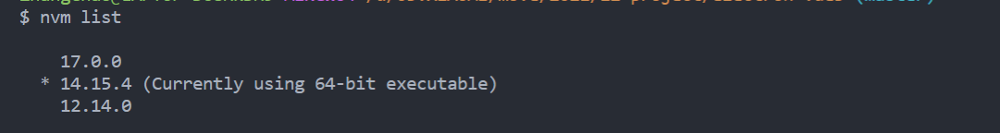

# electron-ffmpeg (super transcoding)


语言:[中文](./README-zh.md)

> technology stack: vue3 + vite + electron + elementui + ffmpeg
>
> project templates: 🥳 ++ integrated templates -- **simple in structure and easy to get started!** ` Electron``Vue3``Vite2 `

Special thanks here to [caoxiemeihao ]([electron-vite/electron-vite-boilerplate: Electron + Vite + TypeScript. Support SerialPort, SQLite3 and node C/C++ addons. (github.com)](https://github.com/electron-vite/electron-vite-boilerplate))

## function

video and audio format conversion

input format = ["mp4", "flv", "ts", "mkv", "avi", "wmv"]

output format = ["mp4", "flv", "ts", "mkv", "avi", "wmv", 'mp3']

> note: the wmv format is too slow to be used

**use effects**


## project initialization

### required configuration

- Node `version ">=16.0.0"`
- npm package management tool, recommended`yarn`
- global installation electron (used in project development)

if the node version is not good, it is recommended to use nvm to manage multiple versions. refer to [the latest configuration tutorial for nvm 2022 - zhihu (zhihu.com](https://zhuanlan.zhihu.com/p/474109586)).



install yarn, electron

```shell
 npm config set ELECTRON_MIRROR http://npm.taobao.org/mirrors/electron/
 # 设置electron 为国内镜像
npm i yarn -g
yarn global  add electron
# 进入项目  安装依赖
yarn install
```

### launch & package


```shell
# dev
yarn dev

# build

yarn build
```

## directory structure

```tree
electron-vue3

├── dist
│   ├── main
│   │   ├── index.cjs
│   │   └── package.js
│   └── preload
│       └── index.cjs
├── public
│   ├── package.json
│   ├── super.ico
│   ├── tool.exe  # ffmpeg
│   └── yarn.lock   # nodemodule for packge
├
├── configs
├   ├── vite-main.config.ts          Main process configuration file, compile SRC /main
├   ├── vite-preload.config.ts       Preloads the script configuration file and compiles SRC /preload
├   ├── vite-renderer.config.ts      Renderer configuration file, compile SRC /renderer
├
├── scripts
├   ├── build.mjs                    Project build script, corresponding to NPM Run Build
├   ├── electron-builder.config.mjs
├   ├── watch.mjs                    Project development script, corresponding to NPM run dev
├
├── src
├   ├── main                         Main process source code
├   ├── preload                      Preload the script source code
├   ├── renderer                     Render process source code
├
```

#### `dist` and `src`

- once the script has been started or packaged, a **`dist` folder is created in the root directory, which is exactly the same as `src`**
- when using some path calculations, especially relative path calculations; maintaining the same directory structure as inside can avoid many problems` dist``src `

```tree
├── dist
├   ├── main
├   ├── preload
├   ├── renderer
├── src
├   ├── main
├   ├── preload
├   ├── renderer
├
```
